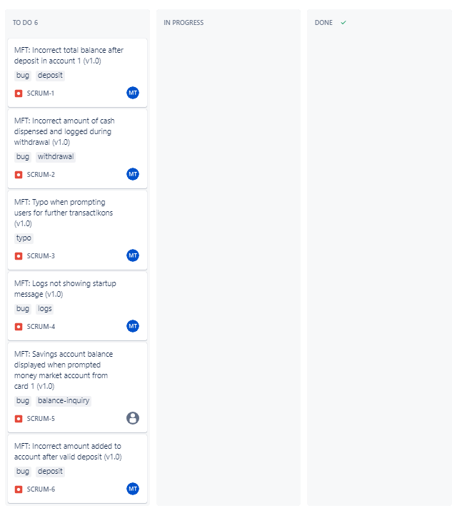
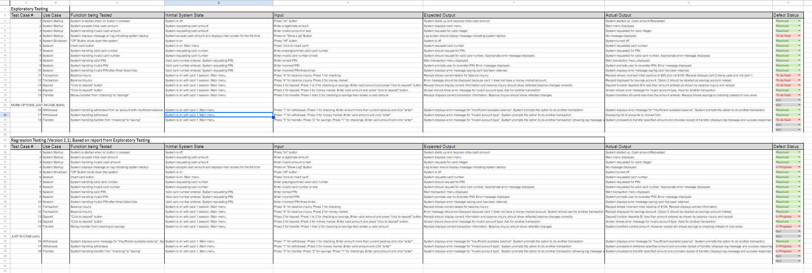
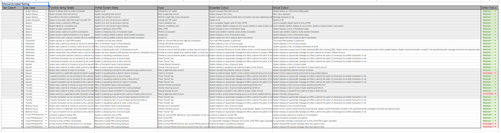

>   **SENG 438 - Software Testing, Reliability, and Quality**

**Lab. Report \#1 – Introduction to Testing and Defect Tracking**

| Group: Group 14      |
|-----------------|
| Eshi Akalumhe               |   
| Emiko Emiko              |   
| Abhyudai Singh               |   
| Marco Truong                |   

**Table of Contents**

(When you finish writing, update the following list using right click, then
“Update Field”)

[1 Introduction	1](#_Toc439194677)

[2 High-level description of the exploratory testing plan	1](#_Toc439194678)

[3 Comparison of exploratory and manual functional testing	1](#_Toc439194679)

[4 Notes and discussion of the peer reviews of defect reports	1](#_Toc439194680)

[5 How the pair testing was managed and team work/effort was
divided	1](#_Toc439194681)

[6 Difficulties encountered, challenges overcome, and lessons
learned	1](#_Toc439194682)

[7 Comments/feedback on the lab and lab document itself	1](#_Toc439194683)

# Introduction

This lab aims to provide useful practice in both scripted and exploratory manual functional testing. By testing two versions of the same system, we gain knowledge in developing a testing plan and measures required to isolate the functions being tested. We will also gain some experience with project management and bug tracking softwares like Jira that are widely used in the industry.

# High-level description of the exploratory testing plan

1. To start with, we’ll ensure that the ON and OFF button work properly. Upon clicking the ON button, the app should prompt the user to enter a number of $20 bills. After a number is entered, the program should take us back to the main screen.

2. Then we’ll test the insert card function. When the insert button is clicked, the program should prompt us for a card number. We’ll first test it with one of the pre-programmed card numbers, then test it with an invalid one. The program should treat an invalid number as an unreadable card. When a real card number is entered, the program should prompt us for a PIN. The program should ask to re-enter the PIN if it is incorrect. A correct PIN should take us to the main menu to choose a transaction type.

3. Next, we’ll test each of the transaction types. We’ll start with a balance inquiry on each account. The initial balances are: Checking: $100 Savings: $1,000 Money Market: $5,000. We’ll do the balance inquiries right after starting the app to ensure that we do not check the balances after any transactions between accounts. 

4. We’ll test the withdrawal function next to see if we can successfully withdraw money from all three account types. Note that card number 1 has no money market account and card number 2 has no savings account. So we shouldn’t be able to withdraw any money from those accounts. If we find that the balance inquiry function from the step above works correctly, we’ll use that to ensure that money is successfully withdrawn from the accounts.

5. Then we’ll check if we can successfully deposit money into the available accounts on cards 1 and 2. We should expect to see the reflected changes after using the balance inquiry function.

6. Next we’ll check if we can successfully transfer money between available accounts on each card. We should also expect to see changes after using the balance inquiry function.

7. For steps 3 to 6 above, we’ll check the receipt printer to ensure that it displays the correct information regarding each transaction, including date, time, machine location, type of transaction, and balance for the affected accounts . We’ll note it as an issue to be resolved if it does not print the right information for a transaction.

8. We’ll check the ATM display as well to ensure that it displays the menus correctly and that it displays an appropriate message 

9. Finally, we’ll check that the show log button works. We should expect to see records of each transaction we make. The log should also display messages when the system is started up and shut down, and for each message sent to the bank.  Note that the log should never display a PIN.

# Comparison of exploratory and manual functional testing

Exploratory testing and manual functional testing are both crucial components of our testing strategy. Exploratory testing allowed us to uncover unforeseen issues by navigating through the application dynamically.This approach proved effective in identifying unexpected behaviors and usability concerns. On the other hand, manual functional testing, as outlined in our scripted testing plan, ensured that specific functionalities were rigorously tested under predefined conditions. Both methods acted complementary to each other, while exploratory testing is flexible and uncovers unforeseen issues, scripted testing provides a structured and repeatable methodology, ensuring that all specified test cases are executed.

In conclusion, our testing approach integrated both exploratory and manual functional testing to leverage their respective strengths and mitigate their individual limitations. 

The jira scrum 1-6 files are under media/jira

Jira Screenshot

The Excel file is under media/excel

Excel screenshot

# Notes and discussion of the peer reviews of defect reports

During the peer review process, our group members carefully examined each other's defect reports to identify any inconsistencies or missing information. The review aimed to ensure the thoroughness and clarity of each defect report. We found that maintaining a consistent format for reporting defects, including details such as whats being tested, inital state, input, expected output and actual output  greatly enhanced the overall quality of the defect tracking process.

# How the pair testing was managed and team work/effort was divided 

Due to some time conflicts, we worked remotely for most of the assignment. Everyone has at least one full run of the exploratory testing plan and each was assigned 10 test cases from the scripted testing plan. Each person then worked with another team member to compare the testing results.

# Difficulties encountered, challenges overcome, and lessons learned

We had some difficulties syncing up with everyone in the team due to conflicting schedules. For that reason we had to come up with an unorthodox testing plan where each person essentially did close to double the amount of testing and have to compare the results with each other. We also were not completely sure on the software to use for the bug tracking in the beginning but did decide on putting everything in an excel sheet in the end.

For this lab, we gained some important experience with the process of manual functional testing including coming up with a testing plan, following a testing script, pair testing, and the importance of writing good bug reports.

# Comments/feedback on the lab and lab document itself

This lab was really helpful in getting us familiar with the testing process and some of the industry standard software used in this field. We, as a group learned a lot about pair testing, Jira, The different types of test suites.

The difficulty of this lab was on a perfect level, not everything was laid out but we weren't completely in the dark. The lab document was extreamly helpful and gave us a platform from which to start.
